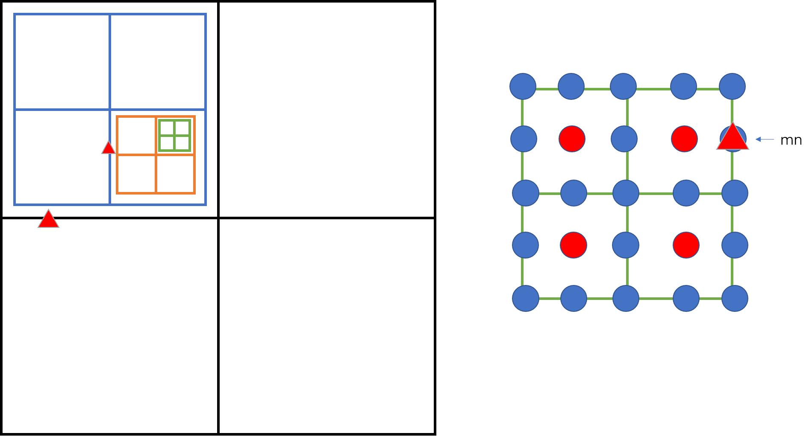

# Good algorithms exercises

[TOC]

## Chapter 1

###  1.4 Analysis of Algorithms

1. *Local minimum of an array.* Write a program that, given an array a[] of N distinct integers, finds a local minimum: an index i such that a[i] < a[i-1] and a[i] < a[i+1]. In case of boundary elements, the number has to be just smaller than its adjacent number. Your program should use ~2lg N compares in the worst case.

   Answer: 首先检查最中间的元素a[N/2]，如果该元素是一个local minimum，停止；否则，必有一侧的元素比中间元素小，易知在包含较小元素不包含中间元素的这半边一定有满足要求的local minimum，故而查找范围缩小一半。整个算法的tilde approximation为 *~2lg N*。

2. Local minimum of a matrix. Given an N-by-N array a[] of N 2 distinct integers, design an algorithm that runs in time proportional to N to find a local minimum: a pair of indices i and j such that a\[i\]\[j\] < a\[i+1\]\[j\], a\[i\]\[j\] < a\[i\]\[j+1\], a\[i\]\[j\] < a\[i-1\]\[j\], and a\[i\]\[j\] < a\[i\]\[j-1\]. The running time of your program should be proportional to N in the worst case.

   Answer: （1）检查四周和中间的行列，即下图中的黑色田字格上的元素，找到其中的最小元素mi（用红色小三角表示），如果m1是一个local minimum，停止；（2）否则，必有一侧的元素比m1还小（如果两侧均比m1小，任取一侧），易知在该侧四分之一象限内的必有满足要求的local minimum元素，故而将下次搜索的范围限定为该四分之一象限（不包括已经查找过的边界），回到第（1）步。以此类推，找到一系列的m1 > m2 > m3 > ... > mn，且每次都将搜索的范围缩小为原来的$1/2$，如果这一系列的mi都不满足条件，考虑最后一次田字格查找的情况。此时，如右图所示，这轮田子格查找的最小元素为mn，对mn而言，如果左侧的元素大于它，mn就是一个local minimum；如果左侧的元素小于mn，那么该元素也小于周围的所有元素，也就满足local minimum的条件。**所以，最坏情况下，最后一次田字格查找一定能够找到一个local minimum。**

   算法复杂度：$~6n + ~6n/2 + ~6n/2^2 + ...  = 12n$。

   

3. *Binary search with only addition and subtraction*. [Mihai Patrascu] Write a program that, given an array of N distinct int values in ascending order, determines whether a given integer is in the array. You may use only additions and subtractions and a constant amount of extra memory. The running time of your program should be proportional to log N in the worst case.

   Answer: 核心的思路仍然是二分查找，关键要是要不使用除2这样的操作来缩减查找的范围，可行的方式是利用Fibonacci数列，搜索范围每次从某一Fibonacci元素，向前变更。实现这个算法的[代码](Codes/FibBinarySearch.java)有点tricky。

   算法复杂度为：$log N$。

4. Throwing eggs from a building. Suppose that you have an N-story building and plenty of eggs. Suppose also that an egg is broken if it is thrown off floor F or higher, and unhurt otherwise. First, devise a strategy to determine the value of F such that the number of broken eggs is ~lg N when using ~lg N throws, then find a way to reduce the cost to ~2lg F.

   Answer: NTA

5. 

      

      

